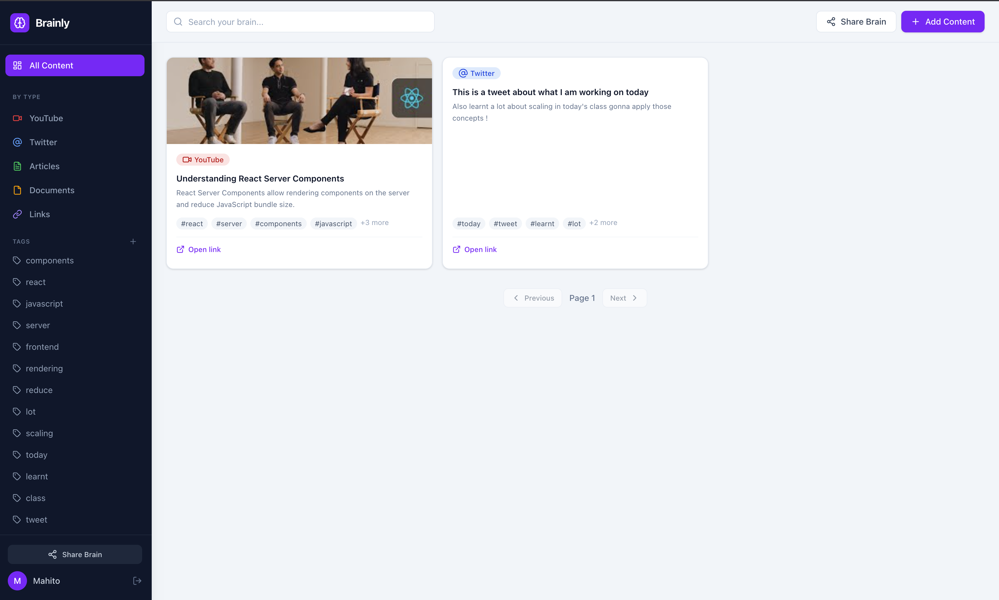
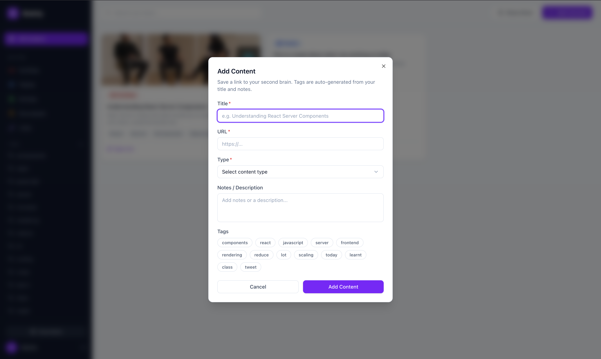
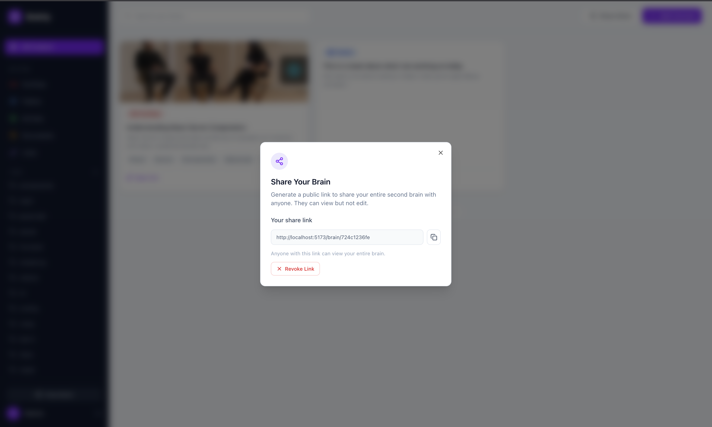

<div align="center">

# 🧠 Brainly — Second Brain API

**Save everything. Find anything. Share your knowledge.**

A production-ready REST API for building your second brain —
bookmark links, articles, videos, and documents with intelligent auto-tagging powered by AI.

[](https://www.typescriptlang.org/)
[](https://nodejs.org/)
[](https://expressjs.com/)
[](https://www.mongodb.com/)
[](https://zod.dev/)

</div>

<div align="center">
## 📽️ Demo
<!-- Add your demo video below -->
https://github.com/user-attachments/assets/cad11a51-bcf4-4310-8266-b276b226ef11
</div>

---
## 📸 Screenshots

<div align="center">
<table>
  <tr>
    <td align="center">
      
      <br/>
    </td>
    <td align="center">
      
      <br/>
    </td>
  </tr>
  <tr>
    <td align="center">
      
      <br/>
    </td>
  </tr>
</table>
</div>

---

## ✨ Features

- 🔐 **JWT Authentication** — Secure signup/signin with bcrypt password hashing
- 📌 **Content Bookmarking** — Save YouTube videos, articles, tweets, documents, and links
- 🤖 **AI Auto-Tagging** — Automatically generates relevant tags from title + content
  - Uses **Google Gemini 1.5 Flash** (free) when `GEMINI_API_KEY` is set
  - Falls back to **Claude Haiku** (Anthropic) when `ANTHROPIC_API_KEY` is set
  - Falls back to a **built-in keyword extractor** — zero API dependency
- 🏷️ **Tag System** — Create, list, and delete personal tags; link them to content
- 🔍 **Search & Filter** — Filter by type, tag, or title search with pagination
- 🌐 **Public Brain Sharing** — Generate a shareable link to your entire brain
- 🛡️ **Production-Grade Validation** — Every endpoint validated with Zod schemas
- ⚡ **Clean Architecture** — Controller → Service → Repository layering throughout

---

## 🏗️ Architecture

```
src/
├── config/           # Database connection
├── controllers/      # HTTP request/response handlers
├── services/         # Business logic
│   └── autoTag.service.ts   # AI tag orchestration
├── repositories/     # MongoDB data access layer
├── models/           # Mongoose schemas
├── routes/           # Express route definitions
├── schemas/          # Zod validation schemas
├── middleware/       # Auth, validation, error handling
└── utils/
    ├── keywordExtractor.ts  # Fallback algorithm-based tagger
    ├── geminiTagGenerator.ts  # Google Gemini integration
    └── llmTagGenerator.ts     # Anthropic Claude integration
```

---

## 🚀 Getting Started

### Prerequisites

- Node.js 20+
- MongoDB (local or [MongoDB Atlas](https://www.mongodb.com/cloud/atlas))
- A free Gemini API key *(optional — for AI tagging)*

### Installation

```bash
# Clone and enter the backend directory
git clone <your-repo-url>
cd brainly/backend

# Install dependencies
npm install

# Copy the environment template
cp .env.example .env
```

### Environment Variables

Create a `.env` file in the `backend/` directory:

```env
# Required
DATABASE_URL=mongodb://localhost:27017/brainly
JWT_SECRET=your_super_secret_jwt_key_here

# Optional — AI Auto-Tagging
# Get a free Gemini key at: https://aistudio.google.com
GEMINI_API_KEY=AIzaSy...

# Or use Anthropic Claude (paid)
# ANTHROPIC_API_KEY=sk-ant-api03-...
```

> **Note:** If neither API key is set, the built-in keyword extractor runs automatically — no setup needed.

### Run Locally

```bash
# Development (with hot reload)
npm run dev

# Production build
npm run build
npm start
```

Server starts at `http://localhost:3000`

---

## 📡 API Overview

| Method | Endpoint | Auth | Description |
|--------|----------|------|-------------|
| `POST` | `/api/v1/signup` | — | Create account |
| `POST` | `/api/v1/signin` | — | Sign in, get JWT |
| `POST` | `/api/v1/content` | 🔒 | Save bookmark (AI auto-tags) |
| `GET` | `/api/v1/content` | 🔒 | List content with filters |
| `PUT` | `/api/v1/content/:id` | 🔒 | Update a bookmark |
| `DELETE` | `/api/v1/content` | 🔒 | Delete a bookmark |
| `POST` | `/api/v1/tags` | 🔒 | Create a tag |
| `GET` | `/api/v1/tags` | 🔒 | List all tags |
| `DELETE` | `/api/v1/tags/:id` | 🔒 | Delete a tag |
| `POST` | `/api/v1/brain/share` | 🔒 | Generate/revoke share link |
| `GET` | `/api/v1/brain/:hash` | — | View shared brain (public) |

> Full documentation with request bodies, cURL examples, and response shapes: [`API_DOCS.md`](./API_DOCS.md)

---

## 🤖 AI Auto-Tagging

When you save content, the backend automatically analyzes the `title` and `content` fields and generates relevant tags.

**Example input:**
```json
{
  "title": "How Redis Pub/Sub Works",
  "content": "Redis Pub/Sub provides a messaging mechanism where publishers send messages to channels."
}
```

**Auto-generated tags:**
```json
["redis", "pub-sub", "messaging", "distributed-systems", "backend"]
```

Auto-tags are merged with any manually provided tag IDs — no duplicates.

**Provider priority:**
```
GEMINI_API_KEY set    →  Google Gemini 1.5 Flash  (free, 1500 req/day)
ANTHROPIC_API_KEY set →  Claude Haiku             (paid, ~$0.25/1M tokens)
neither               →  Keyword Extractor         (free, always works)
```

---

## 🛠️ Tech Stack

| Layer | Technology |
|-------|-----------|
| Runtime | Node.js 20 |
| Language | TypeScript 5 |
| Framework | Express 4 |
| Database | MongoDB + Mongoose |
| Auth | JWT + bcrypt |
| Validation | Zod |
| AI (free) | Google Gemini 1.5 Flash |
| AI (paid) | Anthropic Claude Haiku |

---

## 📄 License

MIT © [Your Name]
